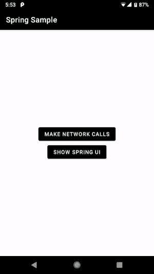

This is a fork of [Chuck](https://github.com/jgilfelt/chuck)

Spring
======



Spring is a simple in-app HTTP inspector for Android OkHttp clients. Spring intercepts and persists all HTTP requests and responses inside your application, and provides a UI for inspecting their content.

Apps using Spring will display a notification showing a summary of ongoing HTTP activity. Tapping on the notification launches the full Spring UI. Apps can optionally suppress the notification, and launch the Spring UI directly from within their own interface. HTTP interactions and their contents can be exported via a share intent.

The main Spring activity is launched in its own task, allowing it to be displayed alongside the host app UI using Android 7.x multi-window support.

Spring requires Android 4.1+ and OkHttp 3.x. and is for AndroidX based projects and Kotlin Support for your project

**Warning**: The data generated and stored when using this interceptor may contain sensitive information such as Authorization or Cookie headers, and the contents of request and response bodies. It is intended for use during development, and not in release builds or other production deployments.

Setup
-----

This library can be used only with apps upgraded for AndroidX (For support library users check out the original project [Chuck](https://github.com/jgilfelt/chuck))

Step 1: // For Pure Java Only Apps, Kotlin user's or people who have enabled kotlin support can Skip to Step 2:

For users who want to continue using Java and use this library, you have to enable kotlin support
Tools -> Kotlin -> Configure Kotlin in Project
In the choose configurator popup, select Android with Gradle
You can click ok for the next popup with the option "All Modules"
Other than a few lines in your Gradle files nothing else would've changed and you can follow the rest of the steps to use the library and continue writing in Java

Step 2:

Include dependencies, the spring-no-op variant can be used for release flavors, to completely disable Spring for release variants

```gradle
    releaseImplementation 'com.okhttpinspector.spring:spring-no-op:1.0.2'
    debugImplementation 'com.okhttpinspector.spring:spring:1.0.2'
```    

and in repositories

``` 
    repositories {
            maven { url "https://dl.bintray.com/droidluv/maven" }
        }
    
```

Step 3:

Use an instance of `SpringInterceptor(context)` and add it as an interceptor when building your OkHttp client:

Java
```java
OkHttpClient client = new OkHttpClient.Builder()
  .addInterceptor(new SpringInterceptor(context))
  .build();
```

Kotlin
```kotlin
val client = OkHttpClient.Builder()
  .addInterceptor(SpringInterceptor(context))
  .build()
```

Step 4:

Spring will now record all HTTP interactions made by your OkHttp client. You can optionally disable the notification by calling `showNotification(false)` on the interceptor instance, and launch the Springs UI directly within your app with the intent from `Spring.INSTANCE.getLaunchIntent(context)` for Java and in Kotlin using `Spring.getLaunchIntent(context)`

EXTRA FEATURES
--------------

You can pre-configure how the Spring Network Activity UI looks by interacting with the Spring singleton

        //For Java
        Spring.INSTANCE.setTitle("Title");
        Spring.INSTANCE.setSubTitle("Subtitle"); // Setting null or no value will show only Title
        Spring.INSTANCE.setStatusBarColorHex("#000000");
        Spring.INSTANCE.setActionBarColorHex("#000000");//This will be used for the notification color accent
        Spring.INSTANCE.setSubtitle(getString(R.string.app_name));
        Spring.INSTANCE.setTabBarBackgroundColorHex("#000000");
        Spring.INSTANCE.setTabBarIndicatorColorHex("#FFFFFF");
        
        //For Kotlin
        Sping.apply{
            val black = "#000000"
            val white = "#FFFFFF"
            title = "BlaBla Network Inspector"
            actionBarColorHex = black
            statusBarColorHex = black
            tabBarBackgroundColorHex = black
            tabBarIndicatorColorHex = white
            allowOrientationChange = false
        }
        
PROGUARD
--------

If you want to use Spring in a signed build with Proguard for some reason just exclude Spring

```proguard
#Spring
-keep public class com.okhttpinspector.spring.** {
    public protected *;
    private <fields>;
}
```

FAQ
---

- Why are some of my request headers missing?
- Why are retries and redirects not being captured discretely?
- Why are my encoded request/response bodies not appearing as plain text?

Please refer to [this section of the OkHttp wiki](https://github.com/square/okhttp/wiki/Interceptors#choosing-between-application-and-network-interceptors). You can choose to use Spring as either an application or network interceptor, depending on your requirements.

Acknowledgements
----------------

Spring uses the following open source libraries:

- [Chuck](https://github.com/jgilfelt/chuck) - Copyright (C) 2017 Jeff Gilfelt (This is the original project from which this project is forked)
- [OkHttp](https://github.com/square/okhttp) - Copyright Square, Inc.
- [Gson](https://github.com/google/gson) - Copyright Google Inc.
- [Cupboard](https://bitbucket.org/littlerobots/cupboard) - Copyright Little Robots.

License
-------
    
    Copyright (C) 2019 Sebi Sheldin Sebastian.

    Licensed under the Apache License, Version 2.0 (the "License");
    you may not use this file except in compliance with the License.
    You may obtain a copy of the License at

       http://www.apache.org/licenses/LICENSE-2.0

    Unless required by applicable law or agreed to in writing, software
    distributed under the License is distributed on an "AS IS" BASIS,
    WITHOUT WARRANTIES OR CONDITIONS OF ANY KIND, either express or implied.
    See the License for the specific language governing permissions and
    limitations under the License.
